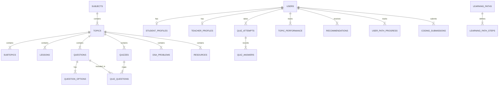

# AI-Smart-Education-System
### Adaptive Personalized Learning Platform Using Explainable AI

---

## 🌟 Executive Summary

**AI-Smart-Education-System** is an enterprise-grade, database-driven, production-ready educational SaaS platform architected for scalable university computer science (B.Tech) curricula, competitive programming, and technical placement prep. 

Unlike traditional black-box adaptive platforms, **AI-Smart-Education-System** incorporates an **Explainable AI (XAI)** recommendation layer. Every diagnostic evaluation provides explicit mathematical attribution:
- Historical topic mastery percentage vs. target benchmarks.
- The triggering diagnostic quiz attempt and score delta ($\Delta$).
- Multi-tier diagnostic mastery classification:
  - $\text{Score} < 40\%$ $\rightarrow$ **Very Weak** (Trigger foundational concept theory & easy diagnostic drills).
  - $40\% \le \text{Score} < 60\%$ $\rightarrow$ **Needs Improvement** (Concept revision & intermediate problem sets).
  - $60\% \le \text{Score} < 80\%$ $\rightarrow$ **Good** (Competitive interview drills).
  - $\text{Score} \ge 80\%$ $\rightarrow$ **Strong** (Advanced edge-case constraints & challenge questions).
- Transparent pedagogical justification for why a specific learning resource was recommended.

---

## 🚀 Key Architectural Highlights

1. **Unlimited & Extensible Content Architecture**:
   - Zero hardcoded subjects, topics, subtopics, lessons, questions, or resources in frontend code.
   - Administrators and Faculty can add unlimited new subjects (e.g. *Cloud Computing*, *Distributed Systems*), create new topics, publish rich Markdown lessons with code blocks, and build quizzes directly from the CMS.
   - Newly published content immediately renders on student dashboards and browse pages without any frontend redeployment.
2. **API-First Modular System**:
   - Clean separation of Frontend (`React 18`, `TypeScript`, `Tailwind CSS`, `Vite`) and Backend (`Express`, `Node.js`, `node:sqlite`).
   - Secure stateless JWT authentication with Role-Based Access Control (`student`, `teacher`, `admin`).
3. **Pluggable AI & External Service Adapters**:
   - Seamless switching between the deterministic pedagogical engine and live cloud LLMs (Gemini / OpenAI) via environment variables.
   - Code execution engine supporting C, C++, Java, Python, and JavaScript with sandbox adapter hooks (Judge0 / Piston).

---

## 🔑 Pre-Seeded Demonstration Personas

You can log in directly or use the **1-Click Persona Switcher** located in the header navigation bar:

| Role | Email | Password | Pre-configured State |
| :--- | :--- | :--- | :--- |
| **Student** | `student@edumentor.ai` | `password123` | Active quiz attempts, weak topic in *Database Normalization* (42%), strong topic in *Dynamic Programming* (85%), 7-day study streak, active XAI recommendations. |
| **Teacher** | `teacher@edumentor.ai` | `password123` | Access to Question Bank authoring, Quiz Builder, Resource Repository, and student cohort performance overview. |
| **Admin** | `admin@edumentor.ai` | `password123` | Full access to Identity & Access Management (IAM), Curriculum Manager (Subjects, Topics, Lessons), and system analytics. |

---

## 🗄️ Relational Database Architecture (25+ Tables)

The system uses a normalized relational architecture (`SQLite 3.x` with `PRAGMA foreign_keys = ON;` and WAL mode for high concurrency):



### Relational Schema Summary:
1. `users`: Authentication records, email, bcrypt password hash, role (`student`, `teacher`, `admin`).
2. `student_profiles`: Benchmark target score, study streaks, total minutes, career goal, academic bio.
3. `teacher_profiles`: Academic department, designation, specialization, research profile.
4. `subjects`: Dynamic B.Tech curriculum subject categories, codes, icons, slugs, ordering.
5. `topics`: Subject-linked topic chapters with difficulty ratings.
6. `subtopics`: Conceptual subdivisions within topics.
7. `courses`: Structured course bundles.
8. `modules`: Course module sections.
9. `lessons`: Academic theory lessons with estimated read times and Markdown content.
10. `learning_contents`: Complex section breakdowns, code snippets, and complexity notes.
11. `questions`: Diagnostic question bank items with code contexts and difficulty tags.
12. `question_options`: Multiple choice options with correctness flag and option-level explanations.
13. `quizzes`: Timed assessments with passing thresholds and difficulty tiers.
14. `quiz_questions`: Normalized junction mapping questions into quizzes with order indices.
15. `quiz_attempts`: Submission records with score, max points, percentage, and time taken.
16. `quiz_answers`: Auditable student choices for every question.
17. `scores`: Historical score timelines.
18. `resources`: Curated supplementary study assets (Articles, Videos, PDFs, Practice Sets).
19. `learning_progress`: Lesson reading progress and completion states.
20. `topic_performance`: Rolling average student performance and mastery levels per topic.
21. `recommendations`: Explainable AI recommendations with explicit pedagogical rationale.
22. `learning_paths`: Guided career roadmaps (e.g. *C++ & DSA Mastery*, *GATE CSE Prep*).
23. `learning_path_steps`: Ordered milestone steps linked to curriculum topics.
24. `user_path_progress`: Interactive step completion records.
25. `dsa_problems`: LeetCode-style algorithmic coding problems with starter code across 5 languages.
26. `coding_submissions`: Problem submission logs with runtime, memory, and status.
27. `bookmarks`: Student saved lessons, resources, and problems.
28. `search_history`: Search queries and analytics.
29. `notifications`: Diagnostic alerts, recommendations, and milestone achievements.

---

## 🧠 Explainable AI (XAI) Recommendation Logic

```
Quiz Submitted
      │
      ▼
Calculate Percentage & Map Questions to Topics
      │
      ▼
Update Topic Performance Aggregate (Exponential Moving Average)
   NewAverage = (OldAverage * 0.4) + (QuizScore * 0.6)
   ScoreDelta = NewAverage - PreviousScore
      │
      ▼
Classify Mastery Level:
   • Very Weak (< 40%)
   • Needs Improvement (40% - 60%)
   • Good (60% - 80%)
   • Strong (> 80%)
      │
      ▼
Pedagogical Attribution Synthesis:
   • Match closest curated resource tailored to detected difficulty level.
   • Generate explicit markdown explaining:
     - The triggering quiz and time of evaluation.
     - The user's score vs. their personalized target score.
     - The exact mathematical score delta.
     - Specific foundational weaknesses identified.
      │
      ▼
Persist to `recommendations` & Dispatch In-App Notification
```

---

## 📡 REST API Specifications

### Authentication & Users
- `POST /api/auth/register` - Create account (Student or Faculty) with bcrypt password hashing
- `POST /api/auth/login` - Authenticate, return signed JWT token and user profile
- `GET  /api/auth/me` - Fetch authenticated user session profile
- `PUT  /api/auth/profile` - Update learning goals, benchmark target score, or faculty info

### Curriculum & Learning
- `GET  /api/subjects` - List active subjects with topic & quiz counts (supports `?category=...`)
- `GET  /api/subjects/categories` - Distinct B.Tech categories
- `GET  /api/subjects/:id` - Complete subject detail with nested syllabus topics, quizzes, resources
- `GET  /api/topics/:id` - Topic syllabus with lessons, quizzes, DSA problems, and student mastery
- `GET  /api/lessons/:id` - Lesson content viewer with Markdown and code snippets
- `POST /api/lessons/:id/complete` - Mark lesson complete, accumulate study minutes and streaks

### Assessment & Evaluation Engine
- `GET  /api/quizzes` - Filter quizzes by subject, topic, and difficulty
- `GET  /api/quizzes/:id` - Load quiz questions (security-sanitized: correct options omitted)
- `POST /api/quizzes/:id/submit` - Grade quiz attempt, calculate score, trigger Explainable AI engine
- `GET  /api/quizzes/attempts/:attemptId` - Review attempt details, correct options, and explanations

### DSA & Coding Practice
- `GET  /api/dsa/topics` - DSA topics with problem volume and student solve counts
- `GET  /api/dsa/problems` - Problem bank with difficulty and solved state filters
- `GET  /api/dsa/problems/:id` - Problem statement, constraints, 5 starter languages, solution
- `POST /api/dsa/run-code` - Run user code against test cases in the test evaluator
- `POST /api/dsa/submit` - Evaluate solution against all test cases, update coding metrics

### Explainable Recommendations & Student Analytics
- `GET  /api/student/dashboard` - Consolidated student dashboard metrics and active recommendations
- `GET  /api/student/analytics` - Quiz score history, topic mastery bars, category coverage
- `GET  /api/recommendations` - List active Explainable AI recommendations
- `POST /api/recommendations/:id/dismiss` - Dismiss recommendation
- `POST /api/recommendations/:id/complete` - Mark recommendation fulfilled
- `GET  /api/learning-paths` - Curated roadmaps with progress percentages
- `POST /api/learning-paths/:id/steps/:stepId/toggle` - Toggle roadmap step completion
- `GET  /api/search` - Multi-entity global search across subjects, topics, lessons, quizzes, problems

### Faculty & Administration
- `GET  /api/teacher/dashboard` - Cohort statistics, class average score, hardest topics
- `POST /api/teacher/questions` - Add question to bank with options and explanations
- `POST /api/teacher/quizzes` - Assemble and publish diagnostic quizzes
- `POST /api/teacher/resources` - Publish curated study notes, articles, and videos
- `GET  /api/teacher/student-performance` - Student roster with quiz histories and mastery levels
- `GET  /api/admin/analytics` - System-wide health metrics and category distributions
- `GET  /api/admin/users` - Full user repository
- `PUT  /api/admin/users/:id/role` - Modify user RBAC permissions
- `DELETE /api/admin/users/:id` - Purge user account
- `POST /api/admin/subjects` - Create new subject dynamically
- `DELETE /api/admin/subjects/:id` - Delete subject and cascade delete associated items
- `POST /api/admin/topics` - Create new topic dynamically
- `POST /api/admin/lessons` - Publish new lesson dynamically

---

## ⚙️ External API Integration Guide

AI-Smart-Education-System is built with clean service adapters (`server/src/services/externalAIAdapter.ts` and `codeRunnerService.ts`). When external API keys are not supplied, the platform automatically falls back to deterministic, explainable local engines with zero runtime errors.

### To Configure External Cloud AI (Gemini / OpenAI):
Create or edit `server/.env`:
```bash
# Google Gemini API
GEMINI_API_KEY=your_gemini_api_key_here

# OR OpenAI API
OPENAI_API_KEY=your_openai_api_key_here

# JWT Security
JWT_SECRET=your_production_secret_key_here

# Optional: Remote Judge0 Sandbox Code Execution
JUDGE0_URL=https://judge0-ce.p.rapidapi.com
JUDGE0_KEY=your_rapidapi_key_here
```
When configured, the `ExternalAIAdapter` transparently routes tutoring doubts and deep concept queries to the configured LLM endpoint, while retaining Explainable AI attribution metadata.

---

## 🏃 Starting the Application

### 1. Run Development Server (Both API and Client concurrently):
From the `AI-Smart-Education-System` root directory:
```bash
npm run dev
```
- **Backend API**: `http://localhost:5000`
- **Frontend App**: `http://localhost:5173`

### 2. Run Comprehensive Automated Verification Suite:
```bash
cd server
npm run test:verify   # or npx tsx src/test-verification.ts
```
All 39 assertions test API health, RBAC security, dynamic content creation, quiz grading, Explainable AI recommendation attribution, and code execution.
